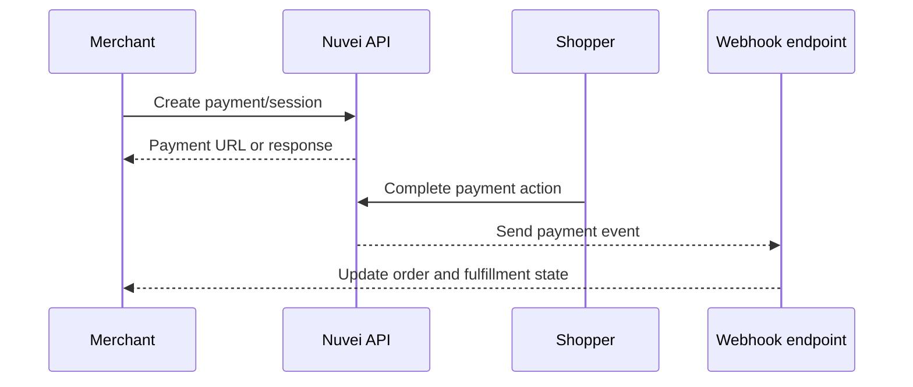

# API Reference

Nuvei's API reference is the canonical technical surface for direct integrations. This demo keeps the narrative concise, shows how developers should think about the payment lifecycle, and makes the OpenAPI migration path explicit.


Production recommendation: import Nuvei's real OpenAPI specifications into GitBook and generate operation pages automatically. Narrative pages should explain implementation strategy, while the spec owns endpoint detail.


<table data-view="cards"><thead><tr><th width="48"></th><th></th><th></th><th data-hidden data-card-target data-type="content-ref"></th></tr></thead><tbody>
<tr><td><i class="fa-key"></i></td><td><strong>Authentication</strong></td><td>Separate environments, credentials, signatures, secret handling, and operational ownership.</td><td><a href="authentication.md">Authentication</a></td></tr>
<tr><td><i class="fa-arrows-rotate"></i></td><td><strong>Payment lifecycle</strong></td><td>Session, authorization, capture, refund, void, dispute, payout, and webhook states.</td><td><a href="payment-lifecycle.md">Payment lifecycle</a></td></tr>
<tr><td><i class="fa-triangle-exclamation"></i></td><td><strong>Errors and retries</strong></td><td>Declines, validation errors, idempotency, retry windows, and graceful shopper recovery.</td><td><a href="errors-and-retries.md">Errors and retries</a></td></tr>
<tr><td><i class="fa-plug-circle-bolt"></i></td><td><strong>Webhooks</strong></td><td>Event delivery, signature verification, fulfillment timing, reconciliation, and replay strategy.</td><td><a href="webhooks.md">Webhooks</a></td></tr>
</tbody></table>

## Recommended API doc split



**Generated reference**

* Endpoint operations
* Parameters and schemas
* Response examples
* Error payloads
* SDK snippets


**Authored guidance**

* Checkout architecture
* Payment state models
* Webhook playbooks
* Go-live checks
* Operational ownership



