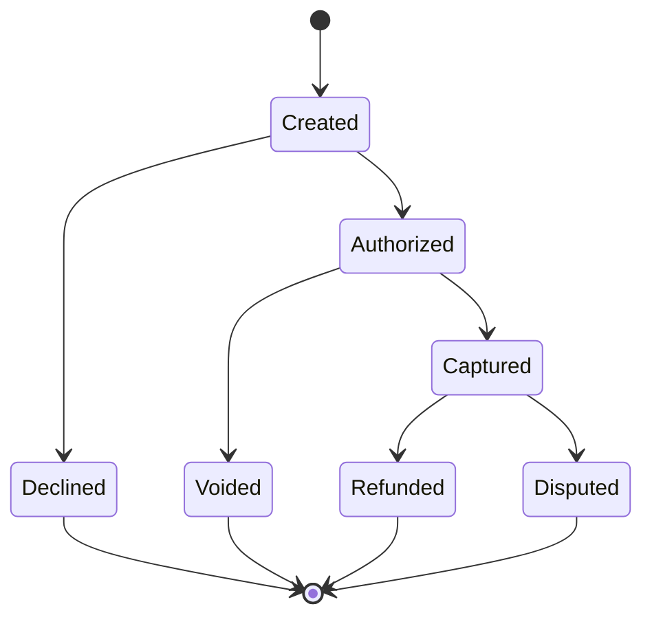

# Payment Lifecycle

## Implementation rule

Treat webhooks and server-side status checks as authoritative. Frontend states improve UX, but they should not be the only signal used for fulfillment or support.
