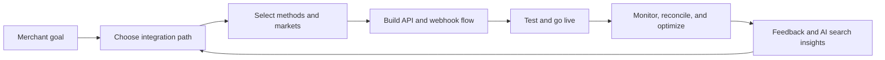

# Nuvei Documentation Hub

The infrastructure for every payment, everywhere.

This demo reframes Nuvei's payments knowledge as one branded operating system for merchants, developers, partners, and internal teams. It keeps Nuvei's global scale at the center: pay-ins, payouts, data, acquiring, risk, banking services, and local payment methods in one searchable place.


Demo assumption: this is a sales-facing first draft, not a full production migration. It mirrors public Nuvei themes and should be replaced with canonical Nuvei source content, OpenAPI specs, and approved regional/compliance language before launch.


## Start from the job you need to finish

<table data-view="cards"><thead><tr><th width="48"></th><th></th><th></th><th data-hidden data-card-target data-type="content-ref"></th></tr></thead><tbody>
<tr><td><i class="fa-rocket"></i></td><td><strong>Launch a payment experience</strong></td><td>Choose Payment Page, Web SDK, server-to-server, plugins, wallets, APMs, and go-live checks.</td><td><a href="https://app.gitbook.com/s/XeLFuyAuy7wt4ZGIWbb5/">Integration guides</a></td></tr>
<tr><td><i class="fa-code"></i></td><td><strong>Build with APIs and webhooks</strong></td><td>Understand credentials, request patterns, payment states, retries, webhook verification, and OpenAPI migration.</td><td><a href="https://app.gitbook.com/s/afWAheAibYE8eCe5yB9X/">API reference</a></td></tr>
<tr><td><i class="fa-chart-line"></i></td><td><strong>Operate payments after launch</strong></td><td>Support finance, risk, reconciliation, reporting, disputes, partner tools, and release operations.</td><td><a href="https://app.gitbook.com/s/rUdUhVNVx8fe3XpFqEmR/">Operations & Support</a></td></tr>
<tr><td><i class="fa-globe"></i></td><td><strong>Scale across markets</strong></td><td>Map payment methods, local acquiring, currencies, regional controls, and readiness by business model.</td><td><a href="market-map.md">Market and method map</a></td></tr>
</tbody></table>

## Platform proof points belong in the docs

<table data-view="cards"><thead><tr><th></th><th></th><th></th></tr></thead><tbody>
<tr><td><strong>720+ payment methods</strong></td><td>Give merchants a clear route from business model to cards, wallets, bank transfers, APMs, BNPL, crypto, and local methods.</td><td>Method readiness</td></tr>
<tr><td><strong>150+ currencies</strong></td><td>Document pricing, settlement, reporting, FX, and reconciliation without burying finance teams in API-only content.</td><td>Finance workflows</td></tr>
<tr><td><strong>200+ markets</strong></td><td>Turn regional launch complexity into guided checklists, market notes, and compliance-aware implementation paths.</td><td>Global launch</td></tr>
<tr><td><strong>50+ local acquiring markets</strong></td><td>Connect local routing, authorization optimization, risk controls, and operational monitoring in one narrative.</td><td>Performance</td></tr>
</tbody></table>

## Current docs, clearer audience paths

Nuvei's public docs already cover Online Payments, APMs, Plugins, Partner Tools, Control Panel, and Security. This demo keeps those pillars, then separates them by reader job so each team lands on the right next action:



**Developers** get a guided path from checkout choice to API implementation, webhook behavior, and testing.

**Merchant operators** get Control Panel, reporting, fraud, support, and reconciliation guidance without jumping across portals.


**Partners and platforms** get plugin, market, and payment-method readiness pages for repeatable onboarding.

**Writers and product teams** get GitBook review flows, AI answers, page feedback, and a cleaner content ownership model.



## What this GitBook version adds

* A single branded hub for product docs, API guidance, operational workflows, and release notes.
* AI answers over all spaces so merchants can ask implementation, risk, and finance questions naturally.
* Git-backed review workflows for technical writers, product, compliance, and regional teams.
* Share-link staging so sales, solutions, and partner teams can review the story before broad publishing.
