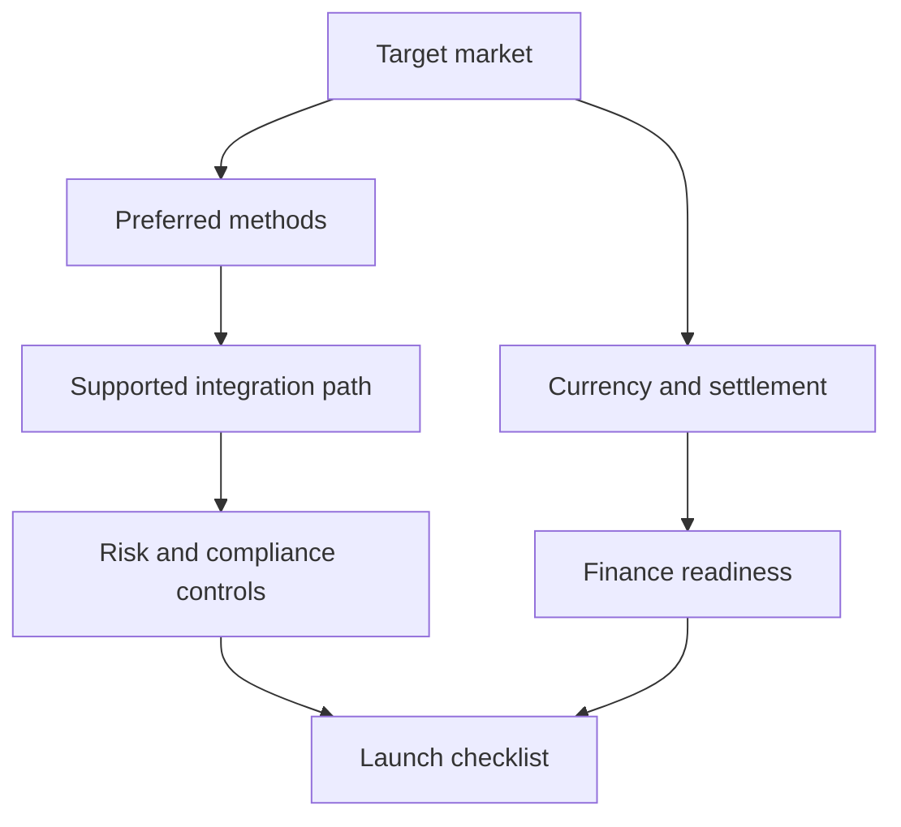

# Market and Method Map

Nuvei's value proposition depends on breadth: global acquiring, local payment methods, APMs, real-time rails, issuing, payout options, banking services, and fraud controls. A strong docs experience should make that breadth navigable without sending each merchant into a long page tree.

<table data-view="cards"><thead><tr><th width="48"></th><th></th><th></th><th data-hidden data-card-target data-type="content-ref"></th></tr></thead><tbody>
<tr><td><i class="fa-credit-card"></i></td><td><strong>Cards and acquiring</strong></td><td>Acceptance, authorization, 3DS, capture, voids, refunds, disputes, and local routing.</td><td><a href="https://app.gitbook.com/s/XeLFuyAuy7wt4ZGIWbb5/online-payments/server-to-server.md">Cards and acquiring</a></td></tr>
<tr><td><i class="fa-building-columns"></i></td><td><strong>Bank transfers and real-time rails</strong></td><td>ACH, RTP, FedNow, SEPA, Faster Payments, Interac, open banking, and regional bank flows.</td><td><a href="https://www.nuvei.com/solutions/bank-transfers">Bank transfers</a></td></tr>
<tr><td><i class="fa-wallet"></i></td><td><strong>Wallets and APMs</strong></td><td>Apple Pay, Google Pay, PayPal, BNPL, QR payments, and local methods merchants expect.</td><td><a href="https://app.gitbook.com/s/XeLFuyAuy7wt4ZGIWbb5/payment-methods/apms.md">Wallets and APMs</a></td></tr>
<tr><td><i class="fa-shield-halved"></i></td><td><strong>Risk, compliance, and optimization</strong></td><td>Fraud rules, dynamic 3DS, PCI scope, chargeback tooling, retry behavior, and market guardrails.</td><td><a href="https://app.gitbook.com/s/rUdUhVNVx8fe3XpFqEmR/risk-and-security.md">Risk and compliance</a></td></tr>
</tbody></table>

## Launch readiness by market

| Question | Why it matters | Route in the hub |
| --- | --- | --- |
| Which payment methods are expected in this market? | Conversion depends on local preference, not just global card coverage. | Integration Guides -> Payment methods |
| Can Nuvei acquire locally or optimize routing here? | Approval rate and cost can change by route, acquirer, and market. | Market map + API lifecycle |
| Which currencies and settlement flows are required? | Finance needs reporting and reconciliation before the first live transaction. | Operations & Support -> Reconciliation |
| Which risk or compliance steps are mandatory? | Go-live can stall when 3DS, fraud, PCI, or regulatory requirements are discovered late. | Operations & Support -> Risk and security |

