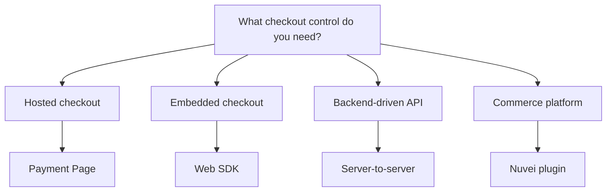

# Choose an Integration Path



Use **Payment Page** when the priority is speed, a hosted checkout page, and reduced frontend complexity.


Use **Web SDK** when the merchant wants a branded checkout but still wants Nuvei to handle sensitive payment fields.


Use **Server-to-server** when payment orchestration happens in the backend and the merchant can support a deeper integration.


Use **Plugins** when the merchant is already on Magento, Shopify, SAP, or another supported platform.



