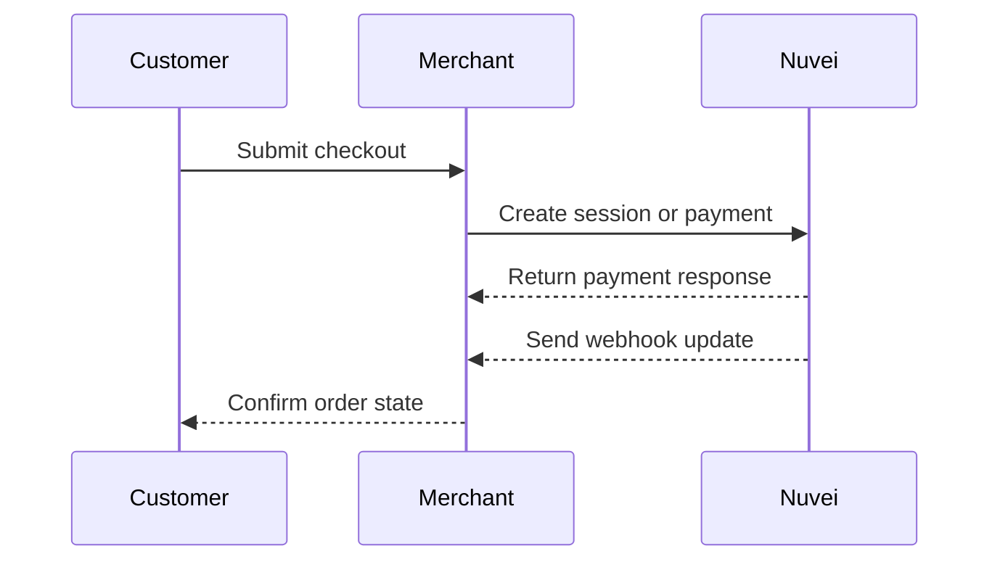

# Server-to-server

Server-to-server integrations put the payment lifecycle under backend control. They are best for merchants with mature engineering teams, custom orchestration, and strong operational requirements.

See the [API Reference](https://app.gitbook.com/s/afWAheAibYE8eCe5yB9X/) for request conventions, authentication, errors, and webhooks.
