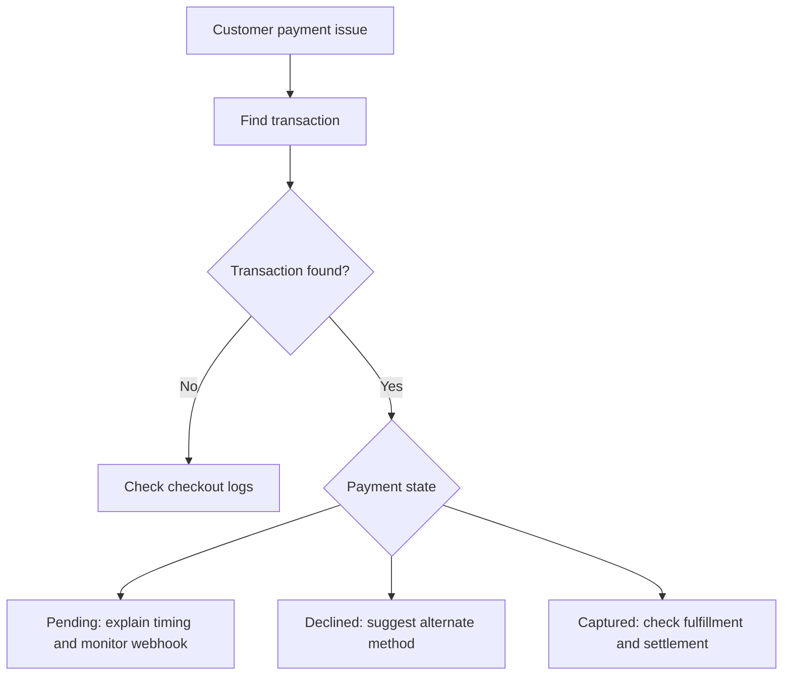

# Support Playbooks

Support teams need concise decision trees that connect customer-facing language to transaction evidence.

```mermaid
flowchart TD
  Ticket[Customer payment issue] --> Search[Find transaction]
  Search --> Missing{Transaction found?}
  Missing -->|No| Checkout[Check checkout logs]
  Missing -->|Yes| State{Payment state}
  State --> Pending[Pending: explain timing and monitor webhook]
  State --> Declined[Declined: suggest alternate method]
  State --> Captured[Captured: check fulfillment and settlement]
```
